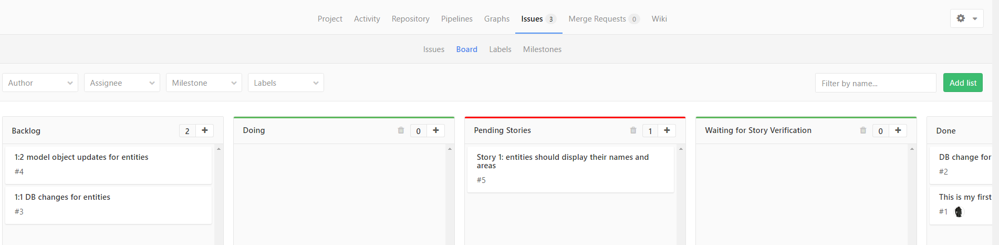
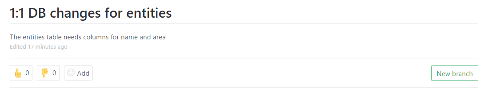
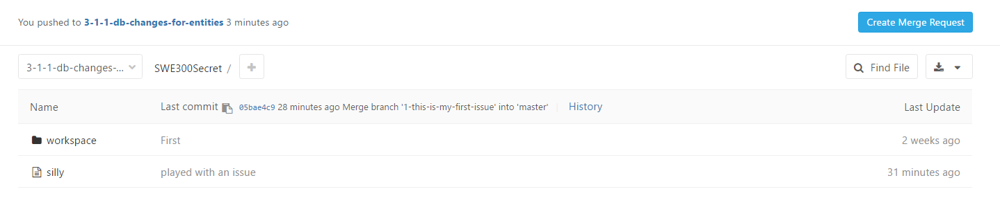
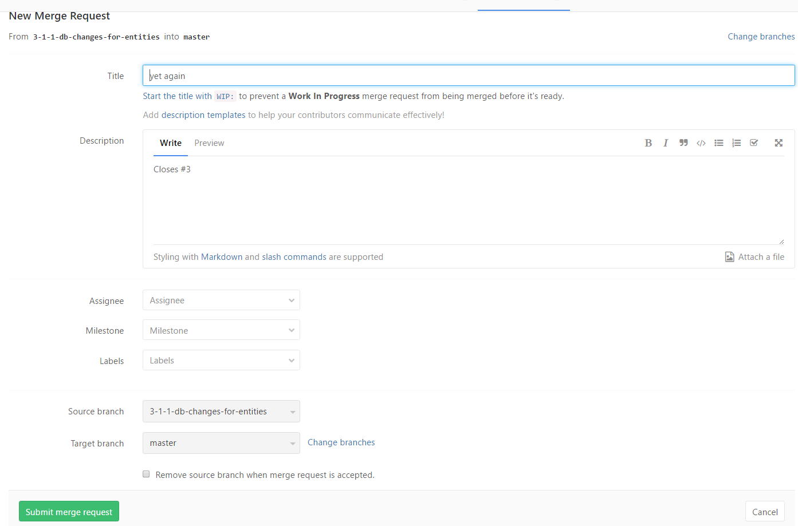

Our Development Process
====

# Planning
* Two week iterations (except possibly around spring break)
* Planning Game played before iteration start
* First class of iteration will be iteration planning game

# Tracking Progress in gitlab

Two kinds of "issues"

* Stories: title must start with "Story X"
  * Description must include how the story will be verified
* Tasks: title must start with "X:Y" where X is story number (or a list of story numbers) and Y is a task number (at least unique within those stories)
 
## Categories
* backlog - tasks we haven't started (this is NOT the normal use of the term "backlog")
* Doing - tasks someone is currently working on
  * there should be a branch for each one of these
* Pending Stories - stories we have committed to that are not yet complete
* Waiting for Story Verification - stories for which all tasks are complete, but the story has yet to be verified as complete
* Done - tasks and stories that are completed

## How to work on a task
* Create a new branch from the issue

* Fetch the repository (to get access to that new branch)
* Check out that branch (note that tab autocompletes the branch name at the command line)
* Make all of the changes necessary for that task
  * TDD!!!!
  * Commit often
  * Push as often as you like (that is your backup)
  * Why do we want tasks to be small?
* When complete, go to the branch on gitlab and make a merge request

* Fill in the details of a merge request and submit it

* I WILL REVIEW THE MERGE REQUEST!!!  DO NOT APPROVE IT!!!! Feel free to let me know that it is there so that I approve it in a timely fashion
* After I approve it, the issue will be marked complete and moved to the Done column

## Story Verification

* In addition to tracking the individual tasks, we need to make sure that they all really work together to complete the functionality in the story
* Each story will be assigned to a story owner who is responsible to
  * Design a procedure for verifying that the story really works (from the user's perspective)
  * Watch all of the tasks associated with that story to make sure they are all making progress toward the end goal.  This means coordinating with the people who are committed to those tasks
  * Move the story to "Waiting for Story Verification" as soon as all of its tasks are "Done."
  * Run the verification procedure and identify any issues
  * Mark the story issue as "Done" when it is verified
  * Be prepared to demonstrate the story to the customer

## Documenting New Issues

If you find a bug (something that is broken or missing in the system or in the documentation) that is not related to this iteration's stories, create an issue specifying: 

* name should start with "Bug: "
* the general problem
* A sequence of steps that recreates the problem if possible. If that isn't possible, at least an explanation of what was happening when you saw it

# Retrospective
* Last class of every iteration
* What went well?
* What went poorly?
* What should we do differently next iteration?